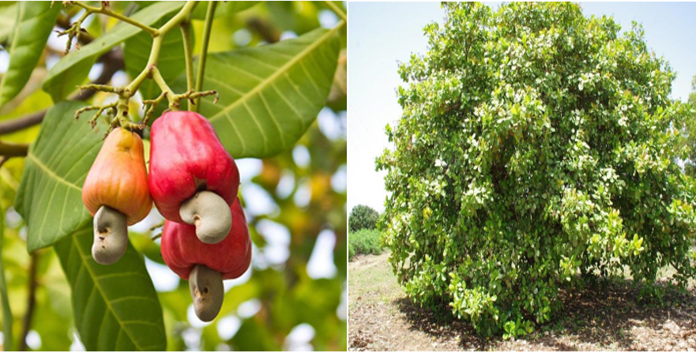

# Système de Détection des Maladies de l'Anacarde

Ce projet vise à développer un système de détection des maladies de l'anacarde, en particulier la maladie anthracnose sur les feuilles, en utilisant des méthodes d'intelligence artificielle, notamment les Convolutional Neural Networks (CNN).

## Objectif du Projet
L'objectif principal de ce projet est de fournir un outil automatisé capable de détecter la maladie anthracnose sur les feuilles de l'anacarde. L'utilisation de techniques d'apprentissage profond, telles que les CNN, permettra d'atteindre une précision élevée dans la détection des symptômes de la maladie.

## Comment ça fonctionne
Le système utilise des données d'images de feuilles d'anacarde, préalablement annotées pour l'apprentissage. Les CNN sont ensuite entraînés sur ces données afin de reconnaître les patterns spécifiques associés à la maladie anthracnose. Une fois le modèle entraîné, il peut être utilisé pour détecter la maladie sur de nouvelles images.

## Contenu du Répertoire
- `/dataset`: Contient le jeu de données d'images annotées utilisé pour l'entraînement.
- `/src`: Contient le code source du projet, y compris les scripts d'entraînement et de détection.
- `/models`: Sauvegarde des modèles entraînés pour la détection des maladies.
- `/docs`: Documentation supplémentaire sur l'utilisation du système.

## Instructions d'Installation et Utilisation
1. Cloner ce dépôt sur votre machine locale.
2. Installer les dépendances en utilisant la commande `pip install -r requirements.txt`.
3. Suivre les instructions spécifiques du dossier `/src` pour l'entraînement et la détection.

N'hésitez pas à contribuer, rapporter des problèmes ou proposer des améliorations !

## Auteurs
- HOUESSOU OSCAR JOEL
- FREDDY HOUNNONDAHO
- 

## Licence
Ce projet est sous licence [MIT](LICENSE).

